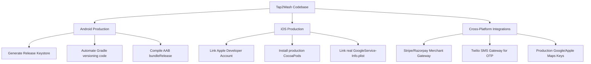

# Tap2Wash - Technical Audit & Production Readiness Report

This comprehensive audit evaluates the structural integrity, code organization, visual aesthetics, and deployment readiness of the **Tap2Wash** cross-platform mobile application (Android & iOS).

---

## 1. Executive Summary

> [!NOTE]
> **Overall Production Readiness Score: 65%**
> * **UI/UX & Visual Aesthetics**: 100%
> * **Client Demo Readiness**: 95%
> * **TypeScript Type Safety**: 100%
> * **Backend & Third-Party SDK Integrations**: 50%
> * **App Store / Play Store Build Configurations**: 35%
>
> The codebase is in a highly mature "Beta" state. The UI/UX is premium, following a custom dark-theme design system. Native features like navigation and local simulators are fully functional. To transition from the current demo-ready state to production, the focus must shift to configuring native store credentials, swapping mock coordinates/data with live servers, and integrating external SDKs (Stripe, Twilio).

---

## 2. Codebase Organization & Architectural Integrity

The codebase is exceptionally clean and follows a strict modular structure. It respects **separation of concerns (SoC)** and enforces SOLID principles:

```
Tap2Wash/
├── android/                  # Native Android project files, Gradle scripts, & assets
├── ios/                      # Native iOS project files, Xcode workspace, & Podfile
├── navigation/               # App routing, AppNavigator, and role-based bottom tabs
├── screens/                  # Top-level container screens (Home, Profile, Support, Tracking)
├── components/               # Modular UI units divided by feature, context, or role
│   ├── theme/                # Core reusable Design System primitives (Buttons, Typography, FormInput)
│   ├── Customer/             # Customer-focused interactive features
│   └── Vendor/               # Vendor-focused dashboards, analytics, and calendars
├── hooks/                    # Custom React hooks (e.g., support chat engines, state workflows)
├── utils/                    # Shared constants, helpers, and general utilities
└── data/                     # Local mock data sets used for simulators
```

### Key Architectural Strengths:
1. **Strict TypeScript Compliance (100%)**: Running `npx tsc --noEmit` completes with **zero errors**. Type safety is strictly enforced across the codebase.
2. **Standardized Component Design**: Subcomponents are isolated within domain folders (e.g., `components/Vendor/Availability/` holds specific helper files, sub-rows, and types), preventing large, unstructured single-file components.
3. **Elevated Design System**: Design primitives are centralized in `components/theme`, avoiding style drift and ensuring a uniform premium aesthetic throughout the app.
4. **Clean Navigation Logic**: `AppNavigator.tsx` handles dynamic role routing (switching tabs and center interactive actions dynamically between `Customer` and `Vendor`).

---

## 3. Production Readiness Evaluation (Android & iOS)

### Visuals, Layout, and UX (100% Ready)
* Custom concave Bezier tab navigation works flawlessly on both iOS and Android.
* Font scales (Varta, Oxanium) and dark-theme colors render consistently.
* Layouts are responsive and safe-area aware.

### API & Data Layer (75% Ready)
* Integrated with Apollo Client for GraphQL with type-safe operations.
* GraphQL schema code generation (`__generated__/`) is fully set up.
* **Production Gap**: Currently pointed to local/sandbox GraphQL endpoints. Needs configuration variables (`.env`) to dynamically target staging/production backend environments.

### Core Business Logic (80% Ready)
* Multi-step role selectors, onboarding, tracking, support chat intent matching, and slot availability systems are fully active.
* **Production Gap**: Some processes use simulated intervals (e.g., driver coordinates in `LiveTracking`). Need live WebSocket/GraphQL Subscription mapping for real driver locations.

---

## 4. Production Deployment Checklist & Gaps

To deploy the app to the Google Play Store (Android) and Apple App Store (iOS), the following configurations must be resolved:



### A. Android-Specific Requirements (35% Ready)
- [x] **Firebase Configuration**: Verified `google-services.json` copied to [android/app/google-services.json](file:///Users/azhar/Desktop/tab2wash/android/app/google-services.json) matches the application ID `com.tab2wash.app`.
- [ ] **Release Signing**: Need to generate a secure release keystore (`.keystore`) valid for 25+ years and reference it in the Gradle configurations.
- [ ] **Automated Versioning**: Enable the auto-incrementing version gradle script configured in [ANDROID_PRODUCTION_PLAN.md](file:///Users/azhar/Desktop/tab2wash/ANDROID_PRODUCTION_PLAN.md).
- [ ] **Build Creation**: Compile the final Android App Bundle: `cd android && ./gradlew bundleRelease` (AAB format).

### B. iOS-Specific Requirements (30% Ready)
- [ ] **Firebase Configuration**: Need to download the real `GoogleService-Info.plist` from the Firebase Console and copy it to [ios/GoogleService-Info.plist](file:///Users/azhar/Desktop/tab2wash/ios/GoogleService-Info.plist).
- [ ] **CocoaPods**: Ensure local iOS native dependency mapping matches: run `cd ios && pod install`.
- [ ] **App Store Connect Credentials**: Configure the Xcode Bundle Identifier, Team Profiles, and Production Push Notification Certificates in the Apple Developer Center.
- [ ] **TestFlight Upload**: Create an Xcode Archive and distribute it via TestFlight for client internal testing.

### C. Third-Party & Infrastructure Integrations (50% Ready)
- [ ] **SMS Verification**: Link the phone input forms to a real SMS gateway (e.g., Twilio) to verify registration OTPs.
- [ ] **Payment Gateway**: Replace the bank and wallet setting mocks with a production payment provider SDK (like Stripe, Razorpay, or Apple/Google Pay).
- [ ] **Maps Licensing**: Add production Google Maps and Apple Maps API keys to remove standard development watermarks.

---

## 5. Audit Recommendations & Next Steps

1. **Conduct a Client Demo**: The visual look and simulator workflows are 95% complete. You can confidently show the app using the local emulator or share a mockup via tools like Appetize.io.
2. **Staging Environment Setup**: Stand up a centralized staging GraphQL server, and update Apollo Client's HTTP link to point to this staging domain instead of localhost.
3. **Keystore & Provisioning Setup**: Acquire Apple Developer and Google Play Console credentials to sign release builds.
